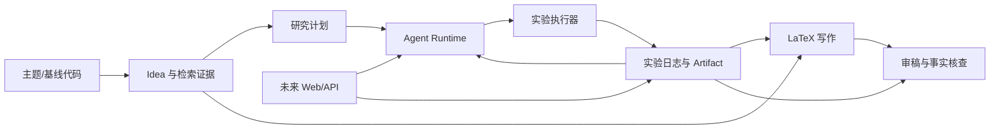

# 端到端 AI 科研智能体平台项目规划

> 状态：分阶段规划，2026-09-22。P0-1 的固定样例执行与记录已实现；P1-1 的结构化提案与检索证据已实现，但真实 API 受到限流，尚无新颖性结论。后续阶段和论文结果均未完成。当前实现和验证见 `docs/execution-plan.md`、`dev-log/progress.md`。

## 1 项目目标

以 [《Towards End-to-End Automation of AI Research》](https://arxiv.org/html/2606.15497) 描述的 The AI Scientist 科研闭环为复现对象，先得到**可运行、可核查、可续做**的最小研究实验，再将其工程化为 Web 平台。交付重点依次为实验执行可信、研究证据连贯、论文内容有来源、过程可观察，最后才是多人平台能力。

范围分两层：

1. **科研核心**：主题或现有代码 → 结构化想法 → 有证据的新颖性检查 → 计划、改代码、运行、诊断、迭代的实验 → 日志与图表 → LaTeX/PDF → 结构化审稿。
2. **产品外壳**：在核心稳定后提供项目、实验树、日志、指标、论文和审批的 Web 入口。

“复现”分级验收，避免把功能跑通误称为论文结果复现：**流程复现**指相同主要阶段和数据交接能完成；**机制复现**指自动修复、记忆、阶段转换与树搜索等关键行为可在受控任务中观察；**结果复现**指使用论文指定模板、数据、指标、模型与预算，得到可比较结果。P1 先争取流程复现，P2/P3 补机制；结果复现需另行确认算力、模型、数据和预算。AI 生成的论文与审稿仅供研究辅助，发表、引文和结论须人工核验。

首个示范任务应是许可明确、CPU 可快速完成、有固定随机种子和基线的小型 Python 实验；真实论文基准与 GPU 实验在执行器可靠后使用用户已有服务器。用户已选择小型 2D Diffusion 作为首个论文复现基线，模板、数据与训练预算尚待核实。验收时保留输入、代码版本、命令、环境、退出状态、原始指标、图、时间和错误，不以 LLM 自述替代执行证据。

## 2 AI Scientist 论文核心机制

论文区分两条路线。基于模板的 [AI Scientist v1](https://github.com/SakanaAI/AI-Scientist) 从可运行的基线代码出发，迭代生成和筛选想法，经 Semantic Scholar 检索新颖性，用代码代理修改实验、运行和自动排错，将结果写入实验日志，然后生成 LaTeX 论文和自动审稿。其官方仓库提供 NanoGPT、2D Diffusion、Grokking 模板；官方说明主要面向 Linux、CUDA、PyTorch，因此不能把当前 Windows CPU 环境视为可直接复跑其原始基准。[论文方法](https://arxiv.org/html/2606.15497)、[v1 仓库](https://github.com/SakanaAI/AI-Scientist)。

不依赖人工模板的 [AI Scientist v2](https://github.com/SakanaAI/AI-Scientist-v2) 从高层研究提案出发，由实验进度管理器组织四阶段：① Preliminary Investigation，验证可运行原型；② Hyperparameter Tuning，寻找稳定设置；③ Main Research Experiments，探索主要方法；④ Ablation Studies，检验组成部分。各阶段内部为带预算与调试深度限制的实验树，节点含父节点、计划、代码、结果、运行反馈和评价；选中的节点成为下一阶段起点。阶段交接依赖结构化 idea 与压缩后的实验日志，而不是重新从主题推断。[论文补充方法](https://arxiv.org/html/2606.15497)、[v2 仓库](https://github.com/SakanaAI/AI-Scientist-v2)。

论文的 Automated Reviewer 读取稿件，输出摘要、优点、弱点、问题和 soundness、presentation、contribution、overall、confidence 等分数。论文进一步使用五份独立审稿与 meta-review；本项目先实现单份结构化审稿，后续再扩展集成。审稿分数不能作为实验真实性或论文可发表性的充分证据。[论文审稿方法](https://arxiv.org/html/2606.15497)。

本项目的复现顺序：先采用 v1 式“小基线 + 明确实验契约”保证可运行，再吸收 v2 的阶段和实验树。借鉴机制与接口，不直接复制参考仓库的代码或 UI；如以后引入代码，须先核对当时仓库版本及许可证。

## 3 Polaris 可以借鉴的工程设计

[Polaris](https://github.com/ZJU-REAL/Polaris) 的价值在科研流程的持久化和可观察性：文献、想法、评审、实验、写作、审稿各阶段产出可追溯对象；长任务有计划、执行、验证、观察、检查点和人工闸门；实验页面能展示正在执行的命令、指标曲线、日志、下一步决策；模型调用集中路由；确定性的解析与校验交给普通代码。[Polaris 架构说明](https://zjureal.com/Polaris/docs/architecture)。

优先借鉴三点：**每一步有持久状态及验收条件**、**实验数据与论文叙述可互相追溯**、**人能看见并控制自动研究行为**。Polaris 使用 React、FastAPI、PostgreSQL、Redis/ARQ 和远程 GPU/SSH 等完整栈，但这不是 P0 的依赖清单。已有服务器使“单机远程实验执行器”成为 P1/P2 的复现需求；多人权限、协作编辑、语义知识库、服务器资源池、MCP、桌面端和市场等留到 P6 评估。[Polaris 仓库说明](https://github.com/ZJU-REAL/Polaris)。

## 4 当前仓库现状

### 实际检查结果

- 本项目是 2026-09-22 用户确认的新项目，根目录为 `D:\codex-workspace\projects\project-007-ai-research-platform`。创建前不存在目标仓库；现已完成 P0-1 固定样例执行器与本地 Git 初始化，没有导入别的项目。当前实现状态见 `docs/execution-plan.md`。
- 初始工作目录 `D:\codex-workspace` 是包含多个独立项目的工作区，本身不是 Git 仓库。新项目当前已有 `pyproject.toml`、CLI、固定样例、实验记录、结构化提案校验、论文检索适配器和测试；仍无 Agent、LLM、前后端、数据库或论文写作实现。初始规划时无源码的判断只适用于 P0-1 开始之前。
- 本地是 Windows 原生 PowerShell 7.6.5；已检查到 Python 3.11.4、Node.js 24.18.0、npm 11.16.0 和 Git 2.47.1。检查范围内未发现本地 Docker、`pdflatex` 或 `tectonic` 命令。未测试外部 API 或 LLM 凭据。
- 用户提供 SSH 别名 `labtmx56`。2026-09-22 只读检查确认该服务器为原生 Linux、Bash、Python 3.12.3，配有 **4 张 NVIDIA GeForce RTX 3090（各 24 GiB）**；SSH 可连通。检查时 4 张卡利用率约 94–100%，显存已占约 18.9–20.9 GiB，因此不能假定当前有空闲训练资源。默认 `python3` 未安装 PyTorch；当前 PATH 未找到 Docker、`nvcc` 和 LaTeX 编译器。尚未检查已有虚拟环境、CUDA 运行时、调度规则、权限与可用时段；这些不能据此判定为不存在。服务器仅作为未来实验执行资源，本轮未在其上创建或修改文件。
- 工作区另有 `project-005-research-workflow`，是独立的科研工作流 Skill 项目，具备证据检索、计划与写作的流程模板，可作为设计参考或外部工具调用候选；它不是本平台已有后端。其他项目也不应自动复制到新项目。

### 对比与复用判断

| 对象 | 已验证的重点 | 对本项目的使用 | 本轮不做 |
| --- | --- | --- | --- |
| AI Scientist v1 | 模板基线、想法、检索、顺序实验、排错、论文、审稿 | P0/P1 流程基线与验收样例 | 原样移植模板或声称结果等价 |
| AI Scientist v2 | 无模板提案、四阶段、实验树、日志节点与最优节点交接 | P2 扩展实验管理 | P0 即运行大规模树搜索 |
| Polaris | 持久任务、可观察性、人工闸门、实验/论文界面 | P4 起逐步工程化 | 首版复制完整微服务和 UI |
| 当前新项目 | P0 固定样例执行器、记录、测试及本地 Git | 在 P0 契约上建立科研流水线 | 将其他独立项目当成现成功能 |

结论：**可复用的是设计知识和经核验的外部 Skill 能力；当前没有可直接继承的本项目代码。** 需要进入实现前重新确认已有资源是否应作为依赖，并明确接口及许可证。

## 5 总体系统架构

按“科研领域核心 → 执行层 → 持久化 → API/UI”渐进组织。建议 Python 3.11 作为核心语言；P0/P1 只用 CLI 与项目本地文件或 SQLite，避免 API、前端和数据库先于实验闭环。执行器先定义本地/远程共用的 run 契约；P1/P2 在核实服务器后增加单机远程执行器，用于实际训练与论文基准。P4 增加 FastAPI 与 React（Vite 或 Next.js 届时按部署需求定）、单机后台 worker；多用户或多服务器调度成为真实需求时再引入 PostgreSQL、可靠队列和 Docker Compose。

当前已有 `src/research_platform/experiments/`、`journal/` 和 `tests/`。建议后续模块边界（尚未创建）：`src/research_platform/ideas/`、`literature/`、`runtime/`、`papers/`、`review/`、`providers/`、`storage/`、`api/`；将来的多项目运行数据可采用 `workspace/projects/<id>/`，P0 当前使用 `workspace/experiments/<run_id>/`。API 只调用领域服务，不直接操作实验进程。LLM Provider Adapter 统一请求、模型标识、用量、错误及重试语义；检索源 Adapter 保存原始来源和查询上下文。科研结论必须引用真实 run 与检索记录。

## 6 数据流

输入主题和可选基线快照后，Idea Generation 输出 `title`、`motivation`、`hypothesis`、`method`、`experiment_plan`、`expected_result` 及版本号。Novelty Check 按查询词、时间、来源、论文 ID/DOI、标题、链接、相似性理由保存证据；搜索失败或覆盖不足标记 `unknown`，不能写成“新颖”。人工可以选择或修改候选 idea。

选定 idea 形成可执行实验契约：基线版本、依赖/数据、执行命令、指标 schema、优化方向、随机种子、时间/成本预算和成功条件。每次计划生成代码差异，先做路径与命令校验，在独立工作目录执行，收集退出码、stdout/stderr、结构化 metrics 和图表，验证后写 journal。下一次决策读取完整或摘要化历史，明确继续、修复、分支或停止的理由。最后写作模块只消费已核查的实验与引文数据；审稿模块输出意见，事实核查再次对照 journal。

数据交接须能在无 LLM 情况下验证：schema 校验、文件存在、指标类型、路径归属、引用标识和数字溯源。记录内容包括原始数据与派生摘要，避免摘要覆盖原始证据。

## 7 Agent Runtime 设计

最小循环：`Planner → Executor → Verifier → Observation → Update Plan`。P0 的 Planner 可先是人工给定的静态单步计划；P1 再接 LLM。状态建议为 `created / planned / awaiting_approval / running / verifying / succeeded / failed / paused / cancelled`，状态变化作为追加事件保存，并拥有单调递增的 step 编号。

每步记录输入快照、动作、预算余额、开始/结束时间、输出引用、验证结论和后继意图。Checkpoint 至少保存 run ID、当前阶段、最后已提交 step、实验分支位置、预算消耗和可重放的 artifact 指针；写入应先落临时文件再原子替换，或使用 SQLite 事务。恢复时先核实进程状态与文件完整性，未知状态不得静默重跑；重试必须有上限并区分模型调用、代码生成和实验执行，防止重复计费或覆盖结果。

超时需终止子进程树并留存日志；取消需留下 `cancelled` 事件；预算至少覆盖实验次数、单次运行时长、累计运行时长、LLM 调用/费用上限。自动执行生成代码必须限制工作目录、可写路径、资源及网络，密钥不传入实验子进程。P0 在未具备可靠沙箱前，只允许运行审核过的受控样例；开放生成代码以容器或等效隔离为上线前置条件。人工批准点至少预留于高成本运行、外部资源使用和最终论文输出。

## 8 实验系统设计

实验分 `Experiment`（研究问题下的逻辑试验）与 `ExperimentRun`（一次具体执行）。一次 run 对应不可变的代码快照/差异、输入、命令、环境摘要、完整输出、退出码与指标；失败和超时也写入 journal。`parent_id` 预留分支关系，使 P0 顺序运行记录可以直接升级为 P2 的树。指标以 `{name, value, unit, direction, split, seed, step}` 等结构存储，另保留原始 `metrics.json`。图表只保存文件元数据、哈希和相对路径，不把任意模型文本当成文件路径执行。

P0 用可重复的小样例验证创建、运行、成功/失败识别、stdout/stderr、指标、artifact 和历史。P1 加入受约束的代码修改、失败诊断与有限自动修复，要求修复前后代码差异可见。P2 在节点表上实现有限分支与选择策略，并加入四阶段：阶段迁移必须由代码可运行、基线比较、预算和实验充分性等可检查条件触发；LLM 评价只作为辅助。任何报告“改进”须核对指标方向、方差与基线可比性。

实验环境记录 Python/包版本、平台、设备、数据版本、随机种子与配置；P1/P2 的远程 GPU 执行器保持与本地相同的 journal 契约。远程任务需记录服务器标识、工作目录、远程进程 ID、上传的代码快照、下载的日志与 artifact 校验值，支持超时和取消；访问凭据留在安全存储中。`labtmx56` 当前 GPU 繁忙且默认 Python 无 PyTorch，因此远程训练前先核实可用虚拟环境、服务器使用规则和空闲资源，不抢占其他任务。复跑时从快照与同一命令重建结果，允许统计波动但须说明容差。

## 9 数据库 / Artifact 设计

P0 可用版本化 JSON journal 与目录布局，P1/P2 引入 SQLite 以支持查询与原子状态更新；不应为尚无并发需求先部署 PostgreSQL。最小实体：`research_projects`、`ideas`、`literature_evidence`、`research_runs`、`experiment_nodes`、`experiment_runs`、`metrics`、`artifacts`、`paper_versions`、`reviews`、`events`、`approval_requests`。实体之间使用稳定 ID；`experiment_nodes.parent_id` 构成树，run 关联节点及代码快照，论文版本关联引用的 run/metric/artifact ID。

运行目录建议：`workspace/projects/<project_id>/experiments/<run_id>/` 下分 `snapshot/`、`stdout.log`、`stderr.log`、`metrics.json`、`artifacts/`、`manifest.json`；`papers/<paper_id>/` 存 `.tex`、`.bib`、PDF 与事实映射。每个 artifact 有类型、SHA-256、大小、来源 run、创建时间和相对路径。数据库保存索引与状态，文件保存大对象；不在日志、数据库或产物中写 API key、token、私钥或敏感 `.env`。删除/清理策略与备份策略在平台化前确定，P0 不自动删除实验历史。

## 10 Web 页面规划

P4 先做只读为主的 Web MVP：Dashboard 显示当前阶段、运行中动作与下一步；Projects 显示研究主题与运行；Ideas 与 Literature 展示想法及检索证据；Experiments 显示树/列表、状态、命令、日志、指标和图；Paper 展示 LaTeX/PDF；Review 展示结构化意见。一次点击应能从论文中的数字追到 metric 和原始 run。P5 再加暂停、继续、重试、取消和审批操作。Settings 的 LLM、预算、计算资源配置逐步开放，凭据只经安全存储入口处理。

首版页面验收聚焦五个问题：AI 在研究什么、为何做该实验、正在执行什么、得到什么结果、下一步准备什么。需要来自后端事件与 journal 的真实状态，不靠前端模拟。多用户、协作编辑、复杂可视化、助手、语义搜索和桌面端留到 P6。

## 11 分阶段 Roadmap

阶段是依赖顺序，不是工期承诺；每阶段通过后再进入下一阶段。P0 先于 UI。P0-1 已实现；后续阶段列出的代码模块均为拟议模块。

### P0：跑通最小实验

- **目标**：在一个受控 CPU 样例上证明实验记录可信。
- **功能**：CLI 创建实验；在独立目录运行审核过的 Python 命令；保存 stdout/stderr、退出码、成功/失败、`metrics.json`、artifact、时间戳和完整 journal；失败样例同样留痕。
- **模块**：`experiments/runner.py`、`experiments/contracts.py`、`journal/store.py`、`storage/artifacts.py`、`cli.py`、`tests/`；项目配置 `pyproject.toml` 与 `.gitignore`。
- **验收标准**：一个成功样例和一个失败样例均生成可查询的 run；指标与 artifact 可追到执行命令和代码快照；单次超时可被识别；从现有记录能解释结果，且没有大规模实验。
- **风险**：Windows 进程树终止、路径越界、指标格式不稳；先限制到固定样例与工作目录。
- **预计依赖**：Python 3.11 标准库为主，pytest 用于关键行为验证；样例选择依赖许可明确的轻量代码。无 LLM/GPU/网页依赖。

### P1：复现 AI Scientist 核心 pipeline

- **目标**：完成 v1 式从想法到实验结果的最小闭环，先证明流程复现。
- **功能**：结构化提案、文献检索与证据、受限代码差异、计划执行、日志分析、有限自动 debug、下一步决策；每一步可人工停止。
- **模块**：`ideas/`、`literature/`、`providers/`、`runtime/`、`experiments/`、`journal/`。
- **验收标准**：给定小基线和主题，能产生 schema 合格的 idea、保存检索证据，完成至少一次代码修改和运行；故障可触发有次数上限的修复尝试；新颖性未知状态可被正确保留。
- **风险**：检索限流、模型输出不符合 schema、自动修复误改代码、执行成本；使用假 Provider 做契约测试，真实模型与沙箱联调另记成本。
- **预计依赖**：确认可用的 LLM Provider、Semantic Scholar 或 OpenAlex/arXiv API、受控代码执行环境；在核实用户服务器的系统/GPU/权限后，为需要训练的基准加入单机远程执行器。不要求 PostgreSQL 或前端。

### P2：加入 Experiment Tree / 自动迭代

- **目标**：复现 v2 的关键实验机制，而非立即追求论文规模。
- **功能**：parent/child 节点、候选分支、节点评分与选择、阶段管理、预算、可追溯的修复/停止原因；四阶段先用小节点预算验证。
- **模块**：`experiments/tree.py`、`experiments/stages.py`、`runtime/planner.py`、`journal/`、`storage/`。
- **验收标准**：至少两条实验分支可独立执行，选择理由可由指标与验证记录重建；阶段迁移有明确规则；超预算停止，失败分支不覆盖成功分支。
- **风险**：搜索成本和指标不可比、模型偏好不稳定；节点/时间预算先设低上限，基线与随机种子固定。
- **预计依赖**：P0/P1 的稳定执行器和 journal，SQLite 事务存储；真实论文训练与树搜索使用已核实的服务器 GPU，并先限定节点、时长和显存预算。

### P3：论文生成 + Reviewer

- **目标**：从真实实验和文献证据产出可编译稿件与可检查审稿。
- **功能**：各节 LaTeX 草稿、图表与 `.bib`、LaTeX→PDF、单 reviewer JSON；数字与引文溯源校验。多 reviewer/meta-review 在单 reviewer 可靠后加入。
- **模块**：`papers/`、`review/`、`literature/citations.py`、`storage/`。
- **验收标准**：PDF 能编译；稿中展示的关键数字映射到真实 run；缺失指标/无效引用被标出且不能伪装成已验证；审稿符合 schema，保存模型与版本信息。
- **风险**：LaTeX 环境当前未安装、编译失败、幻觉引文/数字；选择可重复的编译环境并做确定性事实校验。
- **预计依赖**：P1 文献证据和 P2 journal；经确认的 LaTeX 编译器与模板、LLM Provider。

### P4：Web MVP

- **目标**：让人通过浏览器理解和检查研究过程。
- **功能**：Dashboard、项目、文献/想法、实验树/日志/指标/artifact、论文/PDF、审稿只读页面；提供启动实验的最小入口。
- **模块**：`api/`、`web/`、后台 worker、事件读取接口。
- **验收标准**：页面状态与 journal 一致；运行进度、失败原因和下一步可见；刷新页面后数据不丢；能从指标/论文数字跳到原始 run。
- **风险**：长任务阻塞 API、前后端状态不同步；任务脱离请求线程运行，API 只读持久状态。
- **预计依赖**：P0–P3 稳定数据契约、FastAPI、React/TypeScript、简单后台 worker；部署方案届时确认。

### P5：持久化 / checkpoint / approval

- **目标**：长任务中断后可安全恢复，人在关键操作前可控制。
- **功能**：持久状态机、checkpoint/resume、幂等重试、取消/超时、预算、审批事件和崩溃恢复；验证后再开放长期无人值守运行。
- **模块**：`runtime/state.py`、`runtime/checkpoint.py`、`runtime/approval.py`、`storage/`、`api/`、worker。
- **验收标准**：在受控步骤中模拟进程退出后恢复，已完成实验不被重复执行；审批未通过不执行受限动作；取消和预算耗尽有持久记录。
- **风险**：双重执行、重复计费、孤儿进程和状态竞争；以幂等键、租约/心跳和恢复检查处理。
- **预计依赖**：稳定的实验 ID/事件模型与数据库事务；需要可靠队列时再引入 Redis/ARQ 等。

### P6：完整科研平台

- **目标**：在单项目闭环稳定后满足实验室级使用。
- **功能**：多项目/多用户、多服务器 GPU/SSH 调度、资源配额和成本、语义文献搜索、引用核验、研究时间线、回放审计、助手、多人审稿与 meta-review、Docker Compose 部署。
- **模块**：身份与权限、远程执行器、资源调度、检索索引、审计/备份、部署配置及前端相应模块。
- **验收标准**：不同用户/项目的数据与权限隔离；远程任务可追踪、取消和恢复；成本与实际调用对应；从提案到 PDF 的跨阶段证据可回放；部署和备份恢复经过演练。
- **风险**：远程执行安全、凭据管理、并发一致性、运维成本和数据版权；按独立需求验收，不把 P6 能力提前塞进 P0。
- **预计依赖**：在 P1/P2 已验证单机服务器执行的基础上，明确多人共享和多服务器调度需求；容器环境、PostgreSQL、队列、备份与监控资源按需加入。

## 12 下一步最应该做的一个任务

**P0-1 已完成：最小实验执行契约和受控 CPU 样例。** 已创建项目配置、固定样例执行器、journal、CLI 和少量验证测试；当前只允许执行这些样例，不接 LLM、不检索论文、不建网页、不跑大规模实验。下一步是评审 P0 输出，并选定 P1 的小型研究基线和隔离执行方案。

P0-1 完成条件已用成功、失败和超时三个固定样例验证：命令、退出状态、stdout/stderr、指标或错误、时间与 artifact 清单能从磁盘记录读取。沙箱方案尚未确定，因此继续限制为人工审核的固定样例。

## 资料与核验边界

- [论文 HTML 与补充方法](https://arxiv.org/html/2606.15497)
- [AI Scientist v1 官方仓库](https://github.com/SakanaAI/AI-Scientist)
- [AI Scientist v2 官方仓库](https://github.com/SakanaAI/AI-Scientist-v2)
- [Polaris 官方仓库](https://github.com/ZJU-REAL/Polaris)及[架构文档](https://zjureal.com/Polaris/docs/architecture)

以上是对公开论文与项目说明的架构分析，不是对参考项目代码的本地运行验证。本项目仅完成 P0 的本地固定样例及其验证；尚无论文训练、论文生成或 Web 结果。
